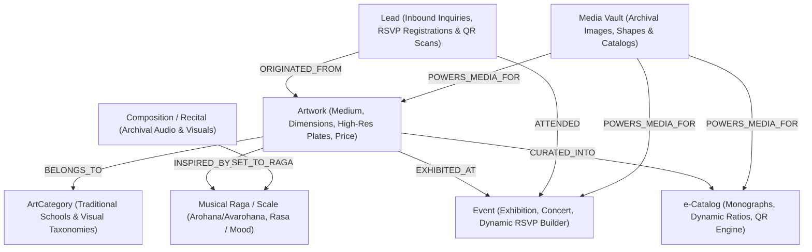
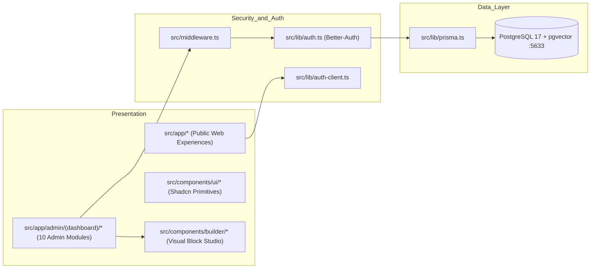

# Skill: Graphify — Architectural & Cultural Knowledge Graph Engine

## 1. Scope & Domain Context
Graphify extracts, organizes, and queries the structural and semantic relationships within the **SavazAI WebApps Platform** (multi-tenant enterprise digital atelier, exhibition corridor, and cultural archive platform). It maintains two synchronized graph layers:
1. **Architectural Graph**: Codebase components, server actions, API routes, Prisma models, and middleware guards.
2. **Cultural Knowledge Graph**: Domain entities linking Artworks, Categories, Musical Ragas/Scales, Compositions/Audio, Exhibitions/Events, e-Catalogs, and Inbound Leads.

---

## 2. Mandatory Agent Operating Protocol (Knowledge Graph First Invariant)
Every autonomous agent, developer, and automated workflow interacting with this codebase must follow this two-phase knowledge invariant:

### Phase 1: Pre-Modification Inspection (Mandatory)
Before modifying, creating, or refactoring any file, component, route, or schema:
- Inspect the active knowledge graph at `graphify-out/` (specifically `graphify-out/GRAPH_REPORT.md` and `graphify-out/graph.json`) or run `graphify query "<topic>"` to identify upstream callers, downstream dependents, and relational boundaries.
- **Invariant**: Never make architectural assumptions without consulting the dependency graph first.

### Phase 2: Post-Workflow Synchronization (Non-Negotiable)
Whenever any files, routes, components, or Prisma schemas are added, modified, or deleted:
- Run `graphify update .` as a non-negotiable quality gate prior to Git staging.
- This rebuilds the AST dependency matrix, clusters community modules, and ensures zero drift between the codebase and its machine-readable knowledge base.

---

## 3. Cultural & Domain Entity Relationship Graph



### Relational Topology
- `(Artwork)-[:BELONGS_TO]->(ArtCategory)`: Groups artworks under traditional artistic disciplines and visual schools (*Tanjore, Mysore, Pahari, Pichwai, Contemporary Fine Art, Classical Sculptures*).
- `(Artwork)-[:INSPIRED_BY { harmonyNote: String }]->(Raga)`: Connects visual aesthetics and color palettes with synesthetic melodic modes (*Bhakti, Shanta, Karuna, Veera*).
- `(Composition)-[:SET_TO_RAGA]->(Raga)`: Associates archival audio tracks and recitals with musical scale frameworks.
- `(ArtworkOnEvent)-[:EXHIBITS { displayOrder: Int }]->(Event)`: Maps physical gallery exhibitions, salon wall corridors, and concert presentations.
- `(Lead)-[:INQUIRED_ABOUT { source: "QR_SCAN" | "PAGE_FORM" | "WEB_FORM" }]->(Artwork | Page)`: Captures provenance of buyer/collector inquiries originating from physical museum placards, QR code cards, or Page Builder dynamic forms directly into the CRM.

---

## 4. Hybrid Relational + pgvector Semantic Search
Artwork visual features and cultural characteristics are encoded into 1536-dimensional semantic embeddings and stored in PostgreSQL 17 via `pgvector`:

```sql
-- Find artworks aesthetically and thematically closest to a query embedding
SELECT 
    a.id, 
    a.title, 
    a.medium,
    c.name AS category_name,
    1 - (a.embedding <=> $1::vector) AS similarity
FROM artworks a
JOIN art_categories c ON a.category_id = c.id
WHERE a.embedding IS NOT NULL
ORDER BY a.embedding <=> $1::vector
LIMIT 8;
```

---

## 5. Codebase Architecture Graph


