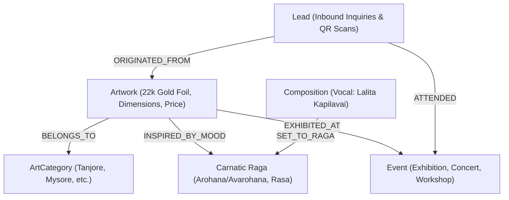
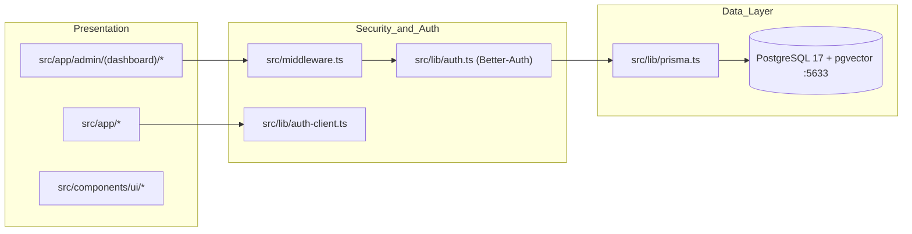

# Skill: Graphify — Architectural & Cultural Knowledge Graph Engine

## 1. Scope & Domain Context
Graphify extracts, organizes, and queries the structural and semantic relationships within the **Lalita Kapilavai** portfolio and cultural archive platform. It maintains two synchronized graph layers:
1. **Architectural Graph**: Codebase components, server actions, API routes, Prisma models, and middleware guards.
2. **Cultural Knowledge Graph**: Domain entities linking Artworks, Categories, Carnatic Ragas, Compositions, Exhibitions/Events, and Inbound Leads.

---

## 2. Cultural & Domain Entity Relationship Graph



### Relational Topology
- `(Artwork)-[:BELONGS_TO]->(ArtCategory)`: Groups artworks under traditional schools (*Tanjore, Mysore, Pahari, Pichwai, Kalamkari, Cheriyal, Miscellaneous*).
- `(Artwork)-[:INSPIRED_BY { harmonyNote: String }]->(Raga)`: Links visual motifs (e.g. Krishna, Devi, Rama) with the melodic raga mood (*Bhakti, Shanta, Karuna*).
- `(Composition)-[:SET_TO_RAGA]->(Raga)`: Associates recorded Carnatic compositions with musical scale frameworks.
- `(ArtworkOnEvent)-[:EXHIBITS { displayOrder: Int }]->(Event)`: Maps physical gallery exhibitions, virtual displays, and concert visuals.
- `(Lead)-[:INQUIRED_ABOUT { source: "QR_SCAN" | "WEB_FORM" }]->(Artwork)`: Tracks provenance of buyer/collector inquiries from physical gallery QR cards directly into the CRM.

---

## 3. Hybrid Relational + pgvector Semantic Search
All artwork visual features and raga characteristics are encoded into 1536-dimensional embeddings and stored in PostgreSQL 17 via `pgvector`:

```sql
-- Find artworks aesthetically and thematically closest to a query embedding
SELECT 
    a.id, 
    a.title, 
    a.medium,
    c.name AS category_name,
    1 - (a.embedding <=> $1::vector) AS similarity
FROM artworks a
JOIN art_categories c ON a.category_id = c.id
WHERE a.embedding IS NOT NULL
ORDER BY a.embedding <=> $1::vector
LIMIT 8;
```

---

## 4. Codebase Architecture Graph


