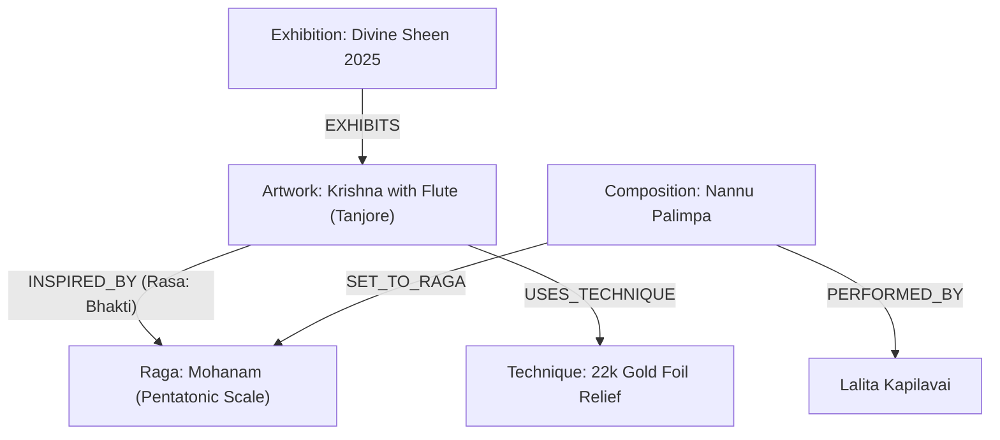

# Skill: Graphify — Cultural Knowledge Graph & Synesthetic Node-Link Architecture

## 1. Domain Vision & Purpose
Lalita Kapilavai’s work uniquely bridges two profound Indian classical disciplines:
1. **Sacred Visual Art**: Tanjore (Thanjavur), Mysore, and temple mural painting.
2. **Carnatic Classical Music**: Vocal renditions of classical ragas, talas, and compositions.

In Indian aesthetic philosophy (*Natya Shastra* & *Rasa theory*), music and visual arts evoke shared emotional states (*Bhavas* and *Rasas*). The **Graphify** architecture models this synesthesia as an interactive knowledge graph, enabling visitors to navigate between an artwork and the Carnatic raga that shares its mood, deity, or devotional narrative.

---

## 2. Core Entities (Nodes)
The system represents the following primary nodes:

- **`Artwork` Node**:
  - Properties: `id`, `title`, `artStyle` (Tanjore, Mysore, Mural), `medium` (22k gold, teakwood), `yearCreated`, `goldPurity`, `embedding` (`vector(1536)`).
- **`Raga` Node**:
  - Properties: `id`, `name` (e.g., *Kalyani*, *Sankarabharanam*, *Mohanam*, *Charukesi*), `melakartaNumber`, `arohana`, `avarohana`, `deity`, `rasa` (Bhakti, Shanta, Karuna), `timeOfDay`, `embedding` (`vector(1536)`).
- **`Composition` Node**:
  - Properties: `id`, `title` (e.g., *Bhavanuta*, *Enneramum*, *Kalyani Amba*), `composer` (Tyagaraja, Dikshitar), `vocalist` ("Lalita Kapilavai"), `audioUrl`, `tala` (Adi, Rupaka), `duration`.
- **`Exhibition` Node**:
  - Properties: `id`, `title`, `venue`, `city`, `startDate`, `endDate`, `posterUrl`.
- **`Technique` Node**:
  - Properties: `id`, `name` (e.g., *Gesso Relief (Chunnam)*, *Pure Gold Foil Imprinting*, *Natural Stone Pigments*, *Semi-Precious Gem Setting*).

---

## 3. Relational Link Topologies (Edges)



### Relational Edges
1. `(Artwork)-[:INSPIRED_BY { rasa: String, harmonyNote: String }]->(Raga)`
   Connects painting visual motifs with melodic mood.
2. `(Composition)-[:SET_TO_RAGA]->(Raga)`
   Associates recorded vocal recitals with their underlying raga framework.
3. `(Exhibition)-[:EXHIBITS { displayOrder: Int }]->(Artwork)`
   Maps physical and virtual exhibition curations.
4. `(Artwork)-[:USES_TECHNIQUE]->(Technique)`
   Documents sacred artisan craft and traditional materials.

---

## 4. Hybrid Relational + pgvector Semantic Search

Graphify leverages PostgreSQL 17 and `pgvector` to enable multi-modal traversal:

```sql
-- Query: Find artworks aesthetically and thematically closest to a given visual embedding
SELECT 
    id, 
    title, 
    art_style, 
    primary_image_url,
    1 - (embedding <=> $1::vector) AS similarity
FROM artworks
WHERE embedding IS NOT NULL
ORDER BY embedding <=> $1::vector
LIMIT 8;
```

### Synesthetic Cross-Modal Query
To retrieve Carnatic compositions that harmonize with the visual themes of an artwork:
```sql
SELECT 
    c.id AS composition_id,
    c.title AS composition_title,
    c.audio_url,
    r.name AS raga_name,
    r.arohana,
    r.avarohana,
    l.harmony_note
FROM artworks a
JOIN artwork_raga_links l ON a.id = l.artwork_id
JOIN ragas r ON l.raga_id = r.id
JOIN compositions c ON c.raga_id = r.id
WHERE a.slug = $1
ORDER BY c.title ASC;
```

---

## 5. UI Visualization Guidelines
- **Graph Explorer Component**: Client component using canvas / SVG rendering.
- **Node Styling**:
  - Artwork nodes: Circular avatars with gold foil border ring (`ring-2 ring-primary/80`).
  - Raga nodes: Glowing amber orbs with soundwave pulse animations.
  - Interactive click: Opens synesthetic drawer with synchronized high-res image zoom and audio playback.
