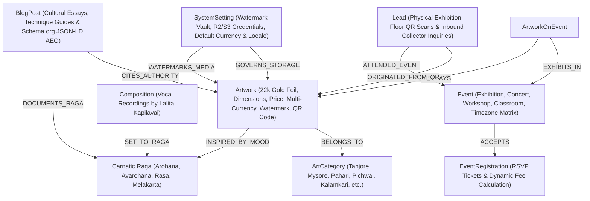

# Lalita Kapilavai — Multi-Layered Knowledge Graph

## 1. Cultural & Domain Entity Knowledge Graph

### Relational & Cultural Topology
1. **`(Artwork)-[:BELONGS_TO]->(ArtCategory)`**:
   Categorizes masterworks under the 7 classical Indian painting schools (*Tanjore, Mysore, Pahari, Pichwai, Kalamkari, Cheriyal, Miscellaneous*).
2. **`(Artwork)-[:INSPIRED_BY_MOOD { harmonyNote: String }]->(Raga)`**:
   Bridges sacred iconographic depictions with classical Carnatic melodic frameworks (e.g. *Navaneetha Krishna* with *Kalyani* or *Madhyamavati*).
3. **`(Composition)-[:SET_TO_RAGA]->(Raga)`**:
   Associates recorded vocal recitals of the Carnatic Trinity (*Tyagaraja, Muthuswami Dikshitar, Syama Sastri*) with raga scales.
4. **`(ArtworkOnEvent)-[:EXHIBITS_IN]->(Event)`**:
   Curatorial link mapping physical gallery floor locations, virtual displays, and concert visuals.
5. **`(Lead)-[:ORIGINATED_FROM_QR { source: "EXHIBITION_QR" }]->(Artwork)`**:
   Physical exhibition floor QR codes (`/artwork/[slug]?qr=true`) direct visitors to interactive audio commentary, simultaneously creating CRM leads.
6. **`(BlogPost)-[:CITES_AUTHORITY]->(Artwork)`**:
   Authoritative cultural essays with embedded Schema.org Article JSON-LD structured for generative search engines (ChatGPT, Perplexity, Claude, Google).
7. **`(Setting)-[:GOVERNS_STORAGE & WATERMARKS_MEDIA]->(Artwork)`**:
   Centralized administrative vault controlling Sharp SVGO watermarking opacity, font size, and Cloudflare R2 / AWS S3 storage buckets.

---

## 2. Codebase Architecture & Route Mapping

```mermaid
graph LR
    subgraph Public_Presentation
        Home["/ (Home Hero)"]
        Gallery["/gallery (Animated Masonry + Multi-Currency)"]
        ArtDetail["/artwork/[slug] (ArtCanvasViewer + Protected Canvas + QR Lead Capture)"]
        EventsPage["/events (Calendar & Recitals)"]
        EventDetail["/events/[slug] (Exhibition Catalog + Localized Dates + RSVP Form)"]
        DynamicPage["/[slug] (12-Column SSR Page + Rich Media: Images, Videos, Icons, Audio)"]
    end

    subgraph Admin_Control_Plane
        AdminDash["/admin (Overview Dashboard)"]
        ArtAdmin["/admin/artworks (Catalog, Currency, Vault & QR Gen)"]
        EventAdmin["/admin/events (Schedule, Localized Timezones & Linker)"]
        PagesAdmin["/admin/pages (12-Col Visual Page Builder + Media Blocks)"]
        NavAdmin["/admin/navigation (2-Tier Menus Console)"]
        CatAdmin["/admin/categories (7 Classical Painting Schools Manager)"]
        LeadAdmin["/admin/leads (Exhibition QR CRM, Status Tracker & CSV Export)"]
        PostAdmin["/admin/posts (Blog & AEO Editorial Desk with Schema.org Preview)"]
        SettingAdmin["/admin/settings (Watermark Vault, R2/S3 Endpoints & Socials)"]
        ProfileAdmin["/admin/profile (User Details, Password Change & Session Revocation)"]
    end

    subgraph API_Endpoints
        MediaUpload["POST /api/admin/media/upload (Sharp Watermarking Pipeline)"]
        ArtworkAPI["/api/admin/artworks/* (CRUD + Currency)"]
        EventAPI["/api/admin/events/* (CRUD + Currency + Timezones)"]
        CatAPI["/api/admin/categories/* (CRUD)"]
        LeadAPI["/api/admin/leads/* (Status PATCH, Search, CSV Export)"]
        PostAPI["/api/admin/posts/* (Blog CRUD + Schema.org Generator)"]
        SettingAPI["/api/admin/settings/* (System Config & Storage Credentials)"]
        RSVPAPI["POST /api/events/register"]
        LeadSubmitAPI["POST /api/leads/submit"]
        AuthAPI["/api/auth/* (Better-Auth Session, Credentials & RBAC)"]
    end

    subgraph Database_Layer
        Prisma["Prisma ORM Client (PostgreSQL Extensions Preview)"]
        Postgres[("PostgreSQL 17 + pgvector (:5633)")]
    end

    Public_Presentation --> API_Endpoints
    Admin_Control_Plane --> API_Endpoints
    API_Endpoints --> Prisma
    Prisma --> Postgres
```

